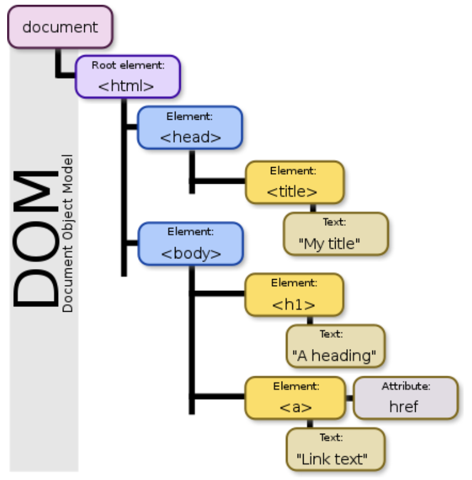

# ReactJS

- [ReactJS](#reactjs)
  - [Why use React?](#why-use-react)
  - [How React works?](#how-react-works)
  - [Features](#features)
    - [Elements](#elements)
      - [Creating elements](#creating-elements)
        - [Traditional method](#traditional-method)
        - [JSX Method (Javascript Syntax Extension)](#jsx-method-javascript-syntax-extension)
      - [Rendering elements](#rendering-elements)
    - [Components](#components)
      - [Function component](#function-component)
      - [Class component](#class-component)
      - [Elements vs Components](#elements-vs-components)
    - [States and Props](#states-and-props)
    - [Component Lifecycle](#component-lifecycle)
  - [Appendix](#appendix)
    - [Library vs Framework](#library-vs-framework)
    - [Document Object Model (DOM)](#document-object-model-dom)
    - [Declarative vs Imperative programming](#declarative-vs-imperative-programming)
    - [Understanding key props](#understanding-key-props)
  - [Resources](#resources)
  - [Topics to explore](#topics-to-explore)

React is a library(not a framework) for building user interfaces. Unlike Angular and AngularJS, React and React.js refers to the same software. It is maintained by Facebook and community. React uses declarative paradigm through which it aims to be both efficient and flexible.

## Why use React?
- Faster and efficient using Virtual DOM
- Reusable web components
- Great community

## How React works?
React implements a virtual DOM that is basically a DOM tree representation in Javascript which are cheap to create. All changes are made to this virtual DOM. It is then compared to the browser’s DOM and the virtual DOM tries to find the most efficient way to update the browser’s DOM. 

Read more:
https://www.geeksforgeeks.org/react-js-introduction-working/
https://medium.com/@gethylgeorge/how-virtual-dom-and-diffing-works-in-react-6fc805f9f84e

## Features

### Elements

In JavaScript like everything is an object, in React everything is an element. React element is an object representation of a DOM node

#### Creating elements

##### Traditional method

```
const p = React.createElement(ElementName, ElementAttributes, ElementContent);

const p = React.createElement(“p”, {className: “paragraph”}, “Sample Text”);
```

##### JSX Method (Javascript Syntax Extension)

It is a library in Babel that makes creation of elements easier with error and warning messages. For using JSX Babel should always be included. It will work even without including Babel but there will be severe performance loss. JSX produces React elements. 
Limitations: inline styling is not allowed.

Example:
```
const p = <p className=”paragraph”>Sample {variable}</p>
```

#### Rendering elements

It is a method of mounting elements from the Virtual DOM into the Javascript DOM. Only those elements are mounted which needs to be changed. This makes the change very fast and efficient. 

Example: 

```
ReactDOM.render(p, document.getElementById(“root”), () => {
	console.log(“Element mounted/rendered”);
})
```

### Components

Function or a class that takes some input and returns React elements.

#### Function component

```
function Car() {
    return “<h2>Hi, I am also a Car!</h2>”;
}
```

- They don’t have a state

#### Class component

```
class Car extends React.Component {
    render() {
        return “<h2>Hi, I am a Car!</h2>”;
    }
}
```
- They have their own state

#### Elements vs Components

Elements are instances of components. Elements are what gets updated in the browser.
https://stackoverflow.com/questions/30971395/difference-between-react-component-and-react-element

### States and Props

Props are variables passed to the components, and state refers to the stored variables in that component. Props are mostly used to initialize the state variables. Props are read only. Props should not change the state of the parent. 

Example:
```
Class ChildComponent extends React.Component{
	constructor(){
	    this.state.color = this.props.color;
    }
}
```

Note: 
- Props should never be changed in a child component, so if there’s something going on that alters some variable, that variable should belong to the component state.
- Props can be implicitly accessed in the render function using this but it needs to be passed explicitly to the constructor to be accessed inside it. 
State should be treated as immutable and should be changed only with this.setState({color: “red”}) 

### Component Lifecycle

Every component has three phases: Mounting, Updating, Unmounting. Lifecycle allows one to monitor these phases and manipulate components accordingly. 

## Appendix

### Library vs Framework

Libraries are helper functions/classes which are already written. These allow a user program to call them for a specific functionality. These are generally lightweight and focus on a specific task, therefore more libraries may be needed to make a user application.


Frameworks on the other hand are applications themselves which consist of unimplemented functions/objects which the user writes/extends to create a custom application. It generally consists of all things necessary to make a user application which includes multiple libraries, scripts, tools for building etc. It defines the concept and the application further defines the functionality.

In other words, libraries are small pieces of code that helps user applications to execute a specific task, where as a framework is a complete system that helps the user build an application.

Read more: 
https://www.geeksforgeeks.org/software-framework-vs-library/
https://stackoverflow.com/questions/148747/what-is-the-difference-between-a-framework-and-a-library

### Document Object Model (DOM)



It is an Object Model that represents HTML and XML documents as a tree structure. HTML/XML elements are represented as nodes/objects of a tree. DOM is constructed by the browser on page load. Each element/object/node has properties, methods and events.

DOM is also an API from Javascript that can access and manipulate HTML DOM elements.

Read more:
https://www.w3schools.com/whatis/whatis_htmldom.asp
https://en.wikipedia.org/wiki/Document_Object_Model


### Declarative vs Imperative programming

Declarative programming is about telling what should be done and Imperative programming is about telling what should be done. A declarative style, like what react has, allows you to control flow and state in your application by saying "It should look like this". An imperative style turns that around and allows you to control your application by saying "This is what you should do".

Example:
Declarative Programming is like asking your friend to draw a landscape. You don’t care how they draw it, that’s up to them.
Imperative Programming is like your friend listening to Bob Ross tell them how to paint a landscape. While good ole Bob Ross isn’t exactly commanding, he is giving them step by step directions to get the desired result.

Read more:
https://codeburst.io/declarative-vs-imperative-programming-a8a7c93d9ad2
https://stackoverflow.com/questions/33655534/difference-between-declarative-and-imperative-in-react-js
https://www.geeksforgeeks.org/react-js-introduction-working/

### Understanding key props

Key props help react to identify the child quickly this in turn increases performance. The key should be unique and static. Meaning it should not be the same and should now change between renders. If unique IDs are not available, some hashing function can be used to generate these unique IDs. 

Read more:
- https://stackoverflow.com/questions/28329382/understanding-unique-keys-for-array-children-in-react-js/43892905#43892905

## Resources

- 2 hours react crash  course: https://www.youtube.com/watch?v=Ke90Tje7VS0
- Tic tac toe intro to React app: https://reactjs.org/tutorial/tutorial.html


## Topics to explore

- How does React’s Virtual DOM work
- Delay between setState and this.state / getState (React setState/getState and asynchronous)